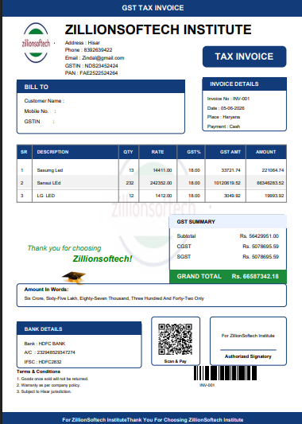

# GST Billing System

## Project Overview

GST Billing System is a Python-based desktop application developed to generate professional GST invoices automatically.

The system calculates GST, CGST, SGST and generates PDF invoices with customer and product details.

## Tools Used

* Python
* Tkinter
* MySQL
* ReportLab

## Features

* Customer Billing
* Product Management
* GST Calculation
* CGST & SGST Calculation
* PDF Invoice Generation
* QR Code Integration
* Barcode Support
* Invoice History

## Business Benefits

* Reduces manual billing effort
* Improves invoice accuracy
* Professional invoice generation
* Faster billing process

## Screenshot

## Future Improvements

* Inventory Management
* Customer Database
* Email Invoice Feature
* Online Payment Integration

## Author

Mohit Kasana
